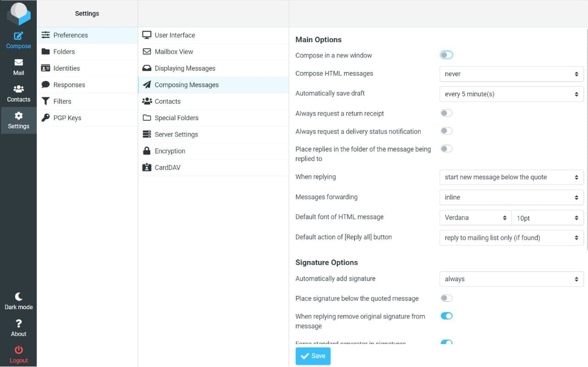

# Mailu CI/CD pipeline

Deploy Mailu server with CI/CD on Elestio

 
 

# Once deployed ...

You can open Mailu UI here:

    URL: https://[CI_CD_DOMAIN]
    email: admin@[CI_CD_DOMAIN]
    password: [ADMIN_PASSWORD]

# Important

You can only have one instance of Mailu per CI/CD target
